<!-- Main -->

<!-- One -->
<section id="one">
	

		<header class="major">
			<h2>Core Components</h2>
		</header>
		

			

				
			

			

			<a href="https://slides.com/donhylo/ethereum" alt="">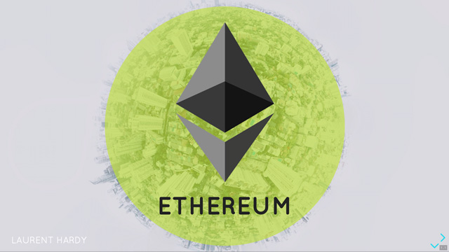</a>
			

			

			<a href="https://slides.com/donhylo/cryptoeconomics" alt="">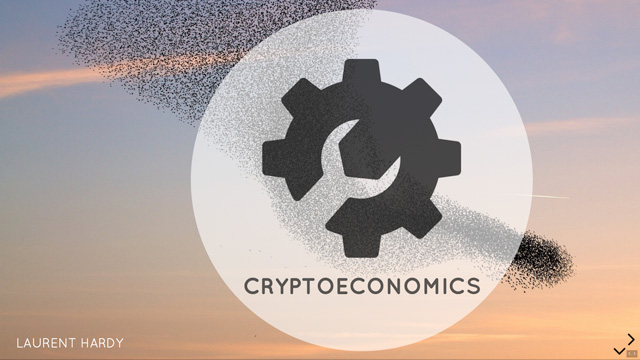</a>
			

		

		

			

			<a href="https://slides.com/sandravizmad/cryptoeconomics" alt="">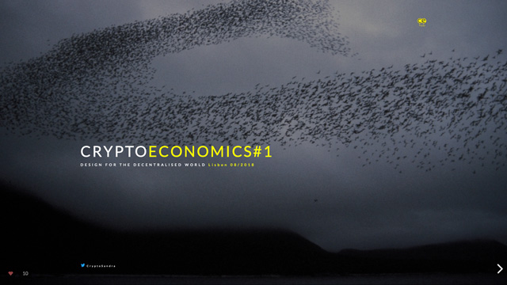</a>
			

			

				<a href="https://slides.com/donhylo/token-based-economic-networks" alt="">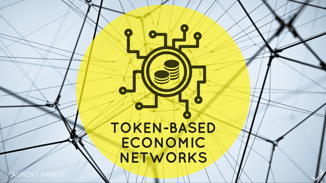</a>
			

			

			<a href="https://slides.com/donhylo/governance" alt="">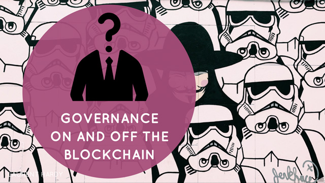</a>
			

		

	

</section>

<!-- Two -->
<section id="two">
	

		<header class="major">
			<h2>dApps, concepts and ideas</h2>
		</header>
		

			

				
			

			

				<a href="https://slides.com/donhylo/keys-addresses-and-wallets" alt="">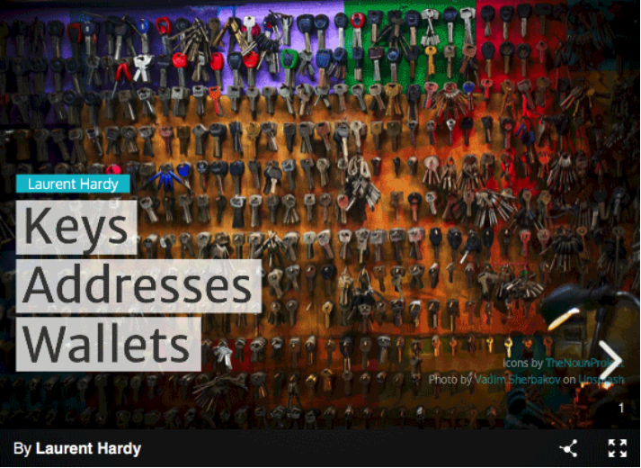</a>
			

			

				<a href="http://slides.com/donhylo/token-curated-registries" alt="">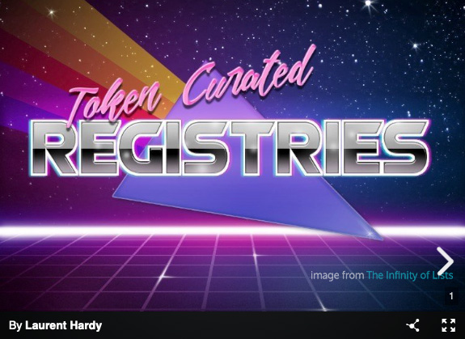</a>
			

		

		

			

				
			

			

				<a href="https://slides.com/donhylo/energy-through-blockchain" alt="">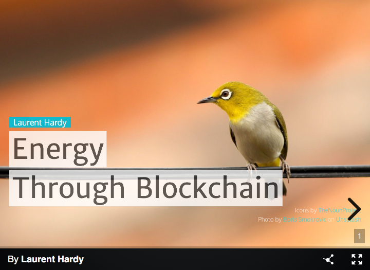</a>
			

			

				<a href="https://slides.com/donhylo/when-blockchain-meets-the-physical-world" alt="">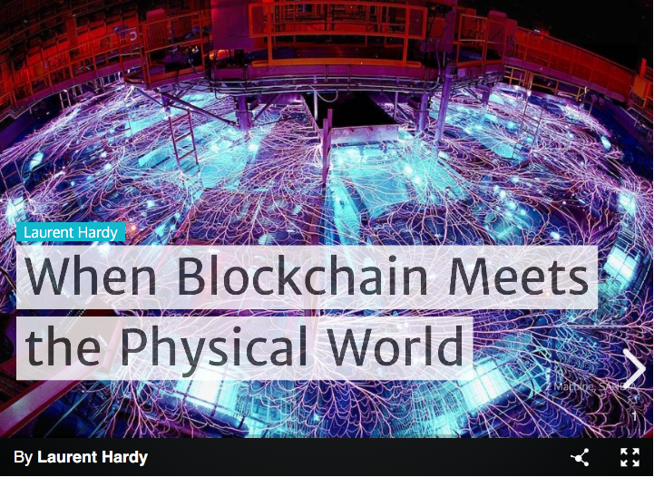</a>
			

		

		

			

				<a href="https://slides.com/donhylo/the-attention-economy" alt="">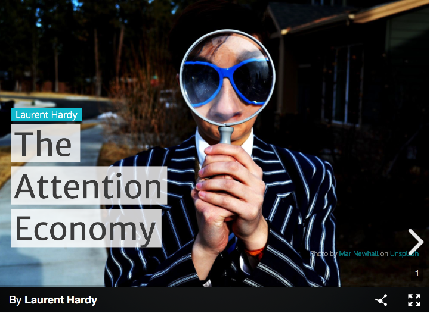</a>
			

			

				
			

			

				
			

		

		

			

				<a href="https://slides.com/donhylo/decentralised-applications" alt="">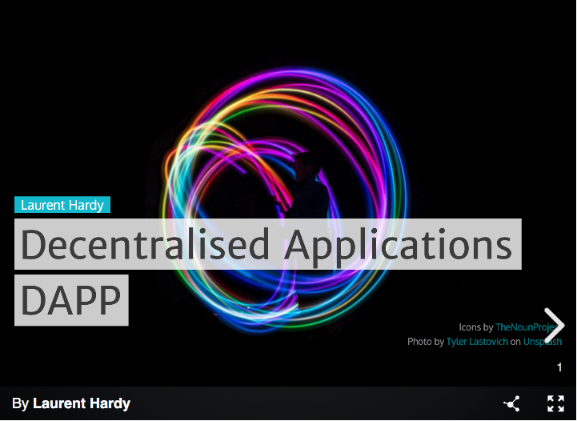</a>
			

		

	

</section>

