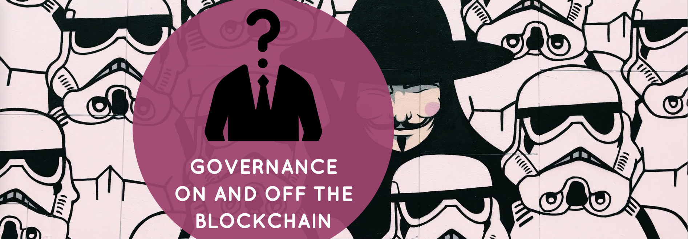

<!-- Main -->

<!-- One -->
<section id="one">
	

    

			

        

					
          <h2>From Banking to Bitcoin</h2>
          
An overview of the Bitcoin blockchain. We expose the characteristics of the infrastructure of Bitcoin as a replacement for fiat money. We highlight the cryptography involved in securing the access to the network. After explaining how securing the network with mining and a consensus algorithm work, we describe the infrastructure of the Bitcoin blockchain. In case of a divergence of opinion, we see how forking the network can play out.

					
<b>Duration</b>: 4 hours

        

      

			

        

					
          <h2>Ethereum, The World Computer</h2>
          
An overview of the Ethereum blockchain. We go over the differences with Bitcoin, its vision, key features, and specific components. We take a look at what Web3 might look like and how and who is building it. Moving forward, scalability is going to be a big problem and we see how it can be solved.

					
<b>Duration</b>: 4 hours

        

      

    

    <!-- Break -->
		

			

				

					
					<h2>Cryptoeconomics</h2>
					
Arguing why cryptoeconomics is relevant at the blockchain base layer and at the dApp token layer. Blockchain is antifragile and cryptoeconomics is responsible making blockchains benefiting from stresses or volatility. Tokens can be considered as incentive machines with superpowers. Cryptoeconomics also offers a path to potential solutions for the scaling problem of blockchain.

					
<b>Duration</b>: 4 hours

					
<b>Recommendation</b>: we advise you to take this module if you are already familiar with <a href="#bitcoin" class="scrolly">Bitcoin</a> and <a href="#ethereum" class="scrolly">Ethereum</a>.

				

			

			

		    

					
		      <h2>Token Based Economic Networks</h2>
		      
What are token-based economic networks? How social order, a balance between collaboration and cooperation, has been achieved historically and where does cryptoeconomics fit in this context to foster innovation in the way economies are organised? What are the super powers of mechanism design? How it works and what role do tokens play? What is the state of the art of the tooling used in mechanism design, i.e Token Engineering?

					
<b>Duration</b>: 3 hours

					
<b>Recommendation</b>: we advise you to take this module if you are already familiar with <a href="#bitcoin" class="scrolly">Bitcoin</a> and <a href="#ethereum" class="scrolly">Ethereum</a> and <a href="#cryptoeconomics" class="scrolly">Cryptoeconomics</a>.

		    

			

		

		<!-- Break -->
		

			

		    

					
		      <h2>Governance Protocol</h2>
		      
Governance is critical and hard because it should allow participants to engage in the decision making process of any project, and at the same time let them feel represented and engaged. Unfortunately, it is often the weak spot of new projects in the blockchain space. We explore the structure of the governance process proposed by Vlad Zamfir, some governance tools, and finally we take a look at a couple of projects to illustrate the concept.

					
<b>Duration</b>: 2 hours

					
<b>Recommendation</b>: we advise you to take this module if you are already familiar with <a href="#ethereum" class="scrolly">Ethereum</a>.

		    

			

			

		    

					
		      <h2>dApp in-depth</h2>
		      
In–depth analysis of dApps that actually need to run on a blockchain. We cover sectors such as: identity, economy of attention, stablecoins, personal data, legally–binding agreements, dispute resolution, supply chain, energy.

					
<b>Duration</b>: 1 to 4 hours

					
<b>Recommendation</b>: no pre-requisite required, although the more familiar you are with <a href="#ethereum" class="scrolly">Ethereum</a>, <a href="#cryptoeconomics" class="scrolly">Cryptoeconomics</a>, and <a href="#token-based-economic-networks" class="scrolly">Token Based Economic Networks</a>, the better you will understand the transformation process those industries are going through.

		    

			

		

  

</section>
<!-- Two -->
<section id="two">
	

		<header class="major">
			<h1>Practical information</h1>
		</header>
		
We are happy to travel to your location to teach our training. We don't offer continuous training on a regular basis.

		
We can offer the training in English, Spanish or French although our support material will always be in English.

		
Please <a href="#contact" class="scrolly">get in touch</a> with the list of modules you would like to take. We will reply to you as soon as possible with an offer.

		
If you would like us to cover the industry you are working in and providing there is enough relevant material, we would be happy to do it for you.

	

</section>
<!-- Three -->
<section id="three">
	

		<header class="major">
			<h1>Professors</h1>
		</header>
		
	

</section>

